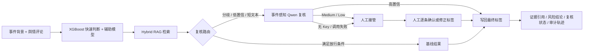

# 可复核中文舆情风险研判 Agent

> **识别本科模型的分布外失效，通过事件感知路由、上下文推理与分级复核，把旧模型升级为可靠系统。**

**在线 Demo：** [魔搭创空间（已验收的面试展示版）](https://modelscope.cn/studios/KristenYue/public-opinion-agent-demo)

项目主线： [模型基座：chinese-sentiment-analysis-thesis](https://github.com/KristenYue/chinese-sentiment-analysis-thesis) → **应用系统：本仓库** → [可靠性评测：agent-reliability-eval](https://github.com/KristenYue/agent-reliability-eval)

## 为什么做这个项目

本科毕设 XGBoost 在原数据分布内可作为快速基线，但在新事件、短文本和上下文依赖评论上会退回 Neutral。系统保留该模型作为快速路，同时用辅助模型分歧、XGBoost 低置信和短文本风险逐条触发事件感知 Qwen 复核；Qwen 只有在高置信时才能形成自动最终标签，否则进入人工兜底。每次升级原因、模型输出、最终标签和决策路径均保留用于审计。

## 关键结果

| 维度 | 结果 | 说明 |
|---|---:|---|
| 工作流 | 6 个执行节点 | 覆盖分类、聚合、检索、路由、复核/放行、报告编排 |
| 自动放行 | 6/36 低风险样本 | 阈值实验中保住高风险样本复核 |
| 证据门禁 | 仅保留 19.4% 高相关证据 | Hybrid RAG 支持同事件排除和引用溯源 |
| 人工闭环 | 可逐条修正标签并重新生成简报 | 复核结果写入 `human_review` 审计轨迹 |
| 事件感知级联 | 已完成代码与契约测试 | 高置信 Qwen 写回最终结果；不确定结果转人工 |
| 冻结评测集 | 599 条、12 个事件 | train/validation/test 按事件隔离；最终测试为 339 条、6 个未见事件 |
| 现场自由测试 | 非预置输入全部强制复核 | 在线 Qwen 高置信才写回，否则人工接管 |

> 指标对应附件所述实验口径，不代表生产 SLA 或线上业务收益。
> Benchmark v1.5 中，旧 XGBoost 在 6 个未见事件、339 条测试评论上的 Accuracy 为 31.27%；事件感知纯自动流程提升至 56.05%（+24.78 个百分点）。这说明旧模型只适合作为基线信号，不能直接承担最终裁决。旧切分上 83.9% 的 Transformer 结果不作为跨事件泛化声明。

## 架构



核心实现位于 `src/opinion_agent/agent/`。Graph 使用 TypedDict `AgentState` 保存中间结果、工具轨迹和降级状态。

## 如何复现

### 环境

- Python 3.11 或 3.12
- 无需 API Key 即可使用合成事件卡运行；预置样例同时展示快速放行、离线验收回放和人工兜底
- 修改预置评论、目标或背景后会自动启用严格复核；无在线 Key 时陌生输入明确转人工
- 首次启用语义检索会下载 `BAAI/bge-small-zh-v1.5`

### 安装与测试

```powershell
python -m venv .venv
.\.venv\Scripts\python.exe -m pip install -r requirements.txt
.\.venv\Scripts\python.exe -m pip install -e .
.\.venv\Scripts\python.exe -m pytest -q
```

### 启动 Gradio Demo

```powershell
.\.venv\Scripts\python.exe app.py
```

打开 `http://127.0.0.1:7860`。稳定演示模式展示预置样例的三条决策路径；现场自由测试模式会强制所有评论进入 Reviewer。即使忘记切换模式，只要修改预置评论、目标或背景，也会自动采用严格策略。若触发人工复核，可在工作台修改最后一列标签，再点击“应用人工复核并重新生成简报”；状态会更新为 `human_completed`。

### 跨事件评测门禁

Benchmark v1.5 共冻结 599 条上下文标注、12 个事件。评测脚本会检查“整个事件只属于一个 split”、人工标注是否完整，以及 validation/test 的盲态 Qwen 响应是否齐全。阈值只在 35 条 validation 数据上选择，锁定后对 6 个未见事件、339 条 test 数据只评一次：

```powershell
.\.venv\Scripts\python.exe scripts\evaluate_event_aware_cascade.py `
  --queue data\evaluation\benchmark_v1_5_queue.jsonl `
  --reviews data\evaluation\benchmark_v1_5_reviews.jsonl `
  --qwen-responses data\evaluation\benchmark_v1_5_qwen_responses.jsonl `
  --output data\evaluation\benchmark_v1_5_final_metrics.json
```

最终测试结果：

| 口径 | Accuracy | Macro-F1 | Negative Recall |
|---|---:|---:|---:|
| XGBoost 基线 | 31.27% | 26.17% | 17.36% |
| 纯自动事件感知级联 | 56.05% | 45.13% | 57.64% |
| 选择性自动（自动覆盖 78.76%） | 66.67% | 53.22% | 70.09% |
| 完整工作流（含 21.24% 人工兜底） | 73.75% | 62.65% | 75.69% |

纯自动 Accuracy 的评论级 bootstrap 95% CI 为 50.74%–61.36%。Qwen 共修正 85 个 XGBoost 错误，产生 1 次 harmful override。完整工作流使用人工标签模拟人工接管后的结果，**不能称为模型准确率**。详见 [Benchmark v1.5 最终结果](docs/BENCHMARK_V1_5_RESULTS.md)；旧版 80 条测试结果保留在 [事件感知跨事件评测](docs/EVENT_AWARE_EVALUATION.md) 中作为历史记录。

### 启动 FastAPI Console

```powershell
.\.venv\Scripts\python.exe scripts\run_public_demo.py --port 8000
```

打开 `http://127.0.0.1:8000/console`。API 请求示例：

```json
{
  "event_id": "关税",
  "query": "分析关税事件评论，并检索可信的历史相似事件",
  "comments": [
    {"sample_id": "demo-1", "text": "普通消费者最后还是要承担更高成本"},
    {"sample_id": "demo-2", "text": "先看看后续具体实施细则"}
  ]
}
```

接口为 `POST /v1/analyze`，健康检查为 `GET /health`。

## 可选 LLM Reviewer

项目使用 OpenAI 兼容接口，通过环境变量注入配置，不在代码或镜像中保存 Key：

```powershell
$env:LLM_BASE_URL="https://your-provider.example/v1"
$env:LLM_API_KEY="replace-me"
$env:LLM_MODEL="your-model"
.\.venv\Scripts\python.exe app.py
```

未配置变量时，争议样本会返回 `manual_required`，随后可在页面完成真实人工复核；这是一条可审计的降级路径，不是模拟 LLM 输出。

阿里云百炼兼容接口示例：

```powershell
$env:LLM_BASE_URL="https://dashscope.aliyuncs.com/compatible-mode/v1"
$env:LLM_API_KEY="通过平台 Secret 注入，不写入仓库"
$env:LLM_MODEL="qwen-plus"
```

## Docker 与公开部署

```powershell
docker build -t opinion-agent-demo .
docker run --rm -p 7860:7860 opinion-agent-demo
```

Hugging Face Spaces 和魔搭创空间的部署步骤、环境变量及验收清单见 [部署文档](docs/DEPLOYMENT.md)。

## 目录结构

```text
app.py                         Gradio 在线 Demo 入口
src/opinion_agent/agent/       LangGraph 状态、节点与条件路由
src/opinion_agent/retrieval/   TF-IDF、语义与 Hybrid RAG
src/opinion_agent/sentiment/   情感模型与第二信号
src/opinion_agent/api.py       FastAPI 入口
examples/                      合成事件卡与离线案例
tests/                         工作流、API、恢复与发布检查
docs/                          架构、评测与部署说明
```

## 数据、安全与限制

- 公开 Demo 只使用合成事件卡，不提交原始微博语料、Cookie、API Key 或用户标识。
- 历史证据用于提供上下文，不证明因果关系；未完成复核的争议评论不得直接作为最终业务结论。
- 当前情感模型是研究基线，尤其不应脱离原帖语境自动解释短句、反讽和立场；线上系统用复核门禁限制其错误外溢。
- 原始建议、采纳原因、工具轨迹和降级状态保留用于审计。
- 数据口径与已知限制见 [DATA_CARD.md](DATA_CARD.md)，安全说明见 [SECURITY.md](SECURITY.md)。
