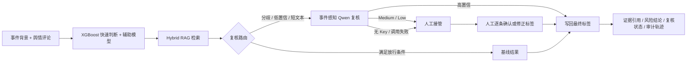

# 可复核中文舆情风险研判 Agent

> **识别本科模型的分布外失效，通过事件感知路由、上下文推理与分级复核，把旧模型升级为可靠系统。**

**在线 Demo：** [魔搭创空间（已验收的面试展示版）](https://modelscope.cn/studios/KristenYue/public-opinion-agent-demo)

项目主线： [模型基座：chinese-sentiment-analysis-thesis](https://github.com/KristenYue/chinese-sentiment-analysis-thesis) → **应用系统：本仓库** → [可靠性评测：agent-reliability-eval](https://github.com/KristenYue/agent-reliability-eval)

## 为什么做这个项目

本科毕设 XGBoost 在原数据分布内可作为快速基线，但在新事件、短文本和上下文依赖评论上会退回 Neutral。系统保留该模型作为快速路，同时用辅助模型分歧、XGBoost 低置信和短文本风险逐条触发事件感知 Qwen 复核；Qwen 只有在高置信时才能形成自动最终标签，否则进入人工兜底。每次升级原因、模型输出、最终标签和决策路径均保留用于审计。

## 关键结果

| 维度 | 结果 | 说明 |
|---|---:|---|
| 工作流 | 6 个执行节点 | 覆盖分类、聚合、检索、路由、复核/放行、报告编排 |
| 自动放行 | 6/36 低风险样本 | 阈值实验中保住高风险样本复核 |
| 证据门禁 | 仅保留 19.4% 高相关证据 | Hybrid RAG 支持同事件排除和引用溯源 |
| 人工闭环 | 可逐条修正标签并重新生成简报 | 复核结果写入 `human_review` 审计轨迹 |
| 事件感知级联 | 已完成代码与契约测试 | 高置信 Qwen 写回最终结果；不确定结果转人工 |
| 新事件标注 | 第一轮 275/275；验证/测试不确定样本二次复核 38/38 | 跨事件评测真值状态为 `second_pass_adjudicated` |
| 现场自由测试 | 非预置输入全部强制复核 | 在线 Qwen 高置信才写回，否则人工接管 |

> 指标对应附件所述实验口径，不代表生产 SLA 或线上业务收益。
> 旧 XGBoost 在最终两个未见事件、80 条测试样本上的 Accuracy 为 42.5%；因此只作为基线信号，不满足生产级自动判定条件。旧切分上 83.9% 的 Transformer 结果不作为跨事件泛化声明。

## 架构



核心实现位于 `src/opinion_agent/agent/`。Graph 使用 TypedDict `AgentState` 保存中间结果、工具轨迹和降级状态。

## 如何复现

### 环境

- Python 3.11 或 3.12
- 无需 API Key 即可使用合成事件卡运行；预置样例同时展示快速放行、离线验收回放和人工兜底
- 修改预置评论、目标或背景后会自动启用严格复核；无在线 Key 时陌生输入明确转人工
- 首次启用语义检索会下载 `BAAI/bge-small-zh-v1.5`

### 安装与测试

```powershell
python -m venv .venv
.\.venv\Scripts\python.exe -m pip install -r requirements.txt
.\.venv\Scripts\python.exe -m pip install -e .
.\.venv\Scripts\python.exe -m pytest -q
```

### 启动 Gradio Demo

```powershell
.\.venv\Scripts\python.exe app.py
```

打开 `http://127.0.0.1:7860`。稳定演示模式展示预置样例的三条决策路径；现场自由测试模式会强制所有评论进入 Reviewer。即使忘记切换模式，只要修改预置评论、目标或背景，也会自动采用严格策略。若触发人工复核，可在工作台修改最后一列标签，再点击“应用人工复核并重新生成简报”；状态会更新为 `human_completed`。

### 跨事件评测门禁

评测脚本会检查“整个事件只属于一个 split”、275 条上下文可见人工标注是否全部完成，以及所有被路由样本是否具有盲态 Qwen 响应。阈值只在验证集选择，锁定后测试集只评一次：

```powershell
.\.venv\Scripts\python.exe scripts\evaluate_event_aware_cascade.py
```

完成后脚本输出 XGBoost 基线、三档置信阈值下的 Accuracy、Macro-F1、各类别 Recall、Qwen 升级率、人工介入率、自动处理率、消融实验和可复现 SVG 权衡曲线。二次复核完成后的测试结果：纯自动 Accuracy 为 58.75%，选择性自动 Accuracy 为 67.74%（覆盖 77.5%），完整“自动 + 人工兜底”流程为 75.0%。详见 [事件感知跨事件评测](docs/EVENT_AWARE_EVALUATION.md)。

### 启动 FastAPI Console

```powershell
.\.venv\Scripts\python.exe scripts\run_public_demo.py --port 8000
```

打开 `http://127.0.0.1:8000/console`。API 请求示例：

```json
{
  "event_id": "关税",
  "query": "分析关税事件评论，并检索可信的历史相似事件",
  "comments": [
    {"sample_id": "demo-1", "text": "普通消费者最后还是要承担更高成本"},
    {"sample_id": "demo-2", "text": "先看看后续具体实施细则"}
  ]
}
```

接口为 `POST /v1/analyze`，健康检查为 `GET /health`。

## 可选 LLM Reviewer

项目使用 OpenAI 兼容接口，通过环境变量注入配置，不在代码或镜像中保存 Key：

```powershell
$env:LLM_BASE_URL="https://your-provider.example/v1"
$env:LLM_API_KEY="replace-me"
$env:LLM_MODEL="your-model"
.\.venv\Scripts\python.exe app.py
```

未配置变量时，争议样本会返回 `manual_required`，随后可在页面完成真实人工复核；这是一条可审计的降级路径，不是模拟 LLM 输出。

阿里云百炼兼容接口示例：

```powershell
$env:LLM_BASE_URL="https://dashscope.aliyuncs.com/compatible-mode/v1"
$env:LLM_API_KEY="通过平台 Secret 注入，不写入仓库"
$env:LLM_MODEL="qwen-plus"
```

## Docker 与公开部署

```powershell
docker build -t opinion-agent-demo .
docker run --rm -p 7860:7860 opinion-agent-demo
```

Hugging Face Spaces 和魔搭创空间的部署步骤、环境变量及验收清单见 [部署文档](docs/DEPLOYMENT.md)。

## 目录结构

```text
app.py                         Gradio 在线 Demo 入口
src/opinion_agent/agent/       LangGraph 状态、节点与条件路由
src/opinion_agent/retrieval/   TF-IDF、语义与 Hybrid RAG
src/opinion_agent/sentiment/   情感模型与第二信号
src/opinion_agent/api.py       FastAPI 入口
examples/                      合成事件卡与离线案例
tests/                         工作流、API、恢复与发布检查
docs/                          架构、评测与部署说明
```

## 数据、安全与限制

- 公开 Demo 只使用合成事件卡，不提交原始微博语料、Cookie、API Key 或用户标识。
- 历史证据用于提供上下文，不证明因果关系；未完成复核的争议评论不得直接作为最终业务结论。
- 当前情感模型是研究基线，尤其不应脱离原帖语境自动解释短句、反讽和立场；线上系统用复核门禁限制其错误外溢。
- 原始建议、采纳原因、工具轨迹和降级状态保留用于审计。
- 数据口径与已知限制见 [DATA_CARD.md](DATA_CARD.md)，安全说明见 [SECURITY.md](SECURITY.md)。
